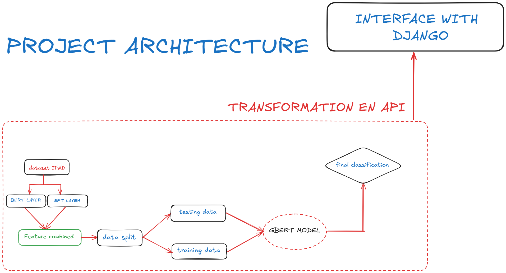

# Detection of fake news:
 > **Fake News Detection** is a project leveraging state-of-the-art deep learning models, including **BERT**, **GPT**, and **GBERT**, to identify and classify fake news articles. By utilizing advanced natural language understanding techniques, this system analyzes the textual content of news articles to determine their authenticity with high accuracy.

# Project architecture:

# Features:

**BERT and GPT Integration**:  
  The system applies the **BERT** model to analyze the news article's content and the **GPT** model for further contextual understanding. Each model generates an individual output.

**Output Combination with GBERT**:  
  The outputs from **BERT** and **GPT** are combined and used as input for the **GBERT** model. **GBERT** is then trained on this combined data to make the final prediction.

**Web Application**:
  A simple user-friendly interface to test the system with custom news articles.

# GBERT Architecture:

# How to start
**Install the dependencies**:
`pip install requirements.txt`

 

